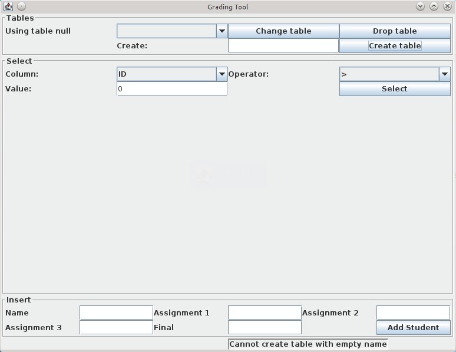

<!-- pandoc readme.md -o readme.pdf -f markdown+auto_identifiers -s -V papersize:"a4paper" -->

# Overview

GradingTool provides several functions for managing a database of grades.
Grades are stored with one row per student, with one table per subject.

# Pre-requisites

I tested using OpenJDK 1.7 and MySQL 14.14 on Ubuntu:

```
$ java -version
java version "1.7.0_65"
OpenJDK Runtime Environment (IcedTea 2.5.2) (7u65-2.5.2-3~14.04)
OpenJDK 64-Bit Server VM (build 24.65-b04, mixed mode)
```

```
$ mysql -V
mysql  Ver 14.14 Distrib 5.5.38, for debian-linux-gnu (x86_64) using readline 6.3
```

## Database

The application uses a properties file `db.properties`.
Edit this file to select a database server. The default values are:

```properties
user=root
password=abc123
server=localhost
port=3306
database=ST11429074
```

# How to run

Extract

```bash
unzip 11429074_ass2.zip
cd ITC313-Ass2-master/task1
```

Create database

```bash
mysql -u root -p < createDatabase.sql
```

Compile and run using ant

```bash
ant
```

# Expected output

Initial screen with no tables.


\FloatBarrier

Clicking *Create table* without entering a table name gives an error


\FloatBarrier

Type a table name and click *Create table* to create a new, empty table.


\FloatBarrier

The new table appears in the drop-down menu and can be used by clicking *Change table*.


\FloatBarrier

Add a student by entering their details and clicking *Add Student*.
Inputs are checked:

Name is missing.


\FloatBarrier

Number is not between 0 and 100.


\FloatBarrier

A number was not entered into one of the grades.


\FloatBarrier

Confirmation when student added:


\FloatBarrier

Click Select to display the new user, including the calculated final score.


\FloatBarrier

Change the column, operator and value to search by any column.


\FloatBarrier

Use `%` as a wild card when using like.


\FloatBarrier


\FloatBarrier


\FloatBarrier
