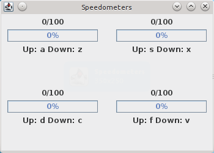
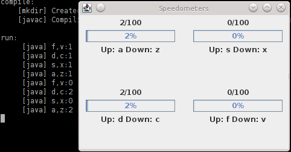

<!-- pandoc readme.md -o readme.pdf -f markdown+auto_identifiers -s -V papersize:"a4paper" -->

# Overview


# Pre-requisites

I tested using OpenJDK 1.7 on Ubuntu:

```
$ java -version
java version "1.7.0_65"
OpenJDK Runtime Environment (IcedTea 2.5.2) (7u65-2.5.2-3~14.04)
OpenJDK 64-Bit Server VM (build 24.65-b04, mixed mode)
```

# How to run

Extract

```bash
unzip 11429074_ass2.zip
cd ITC313-Ass2-master/task2
```

Compile and run using ant

```bash
ant
```

# Expected output

Initial screen with four Speedometers. Note that the Keys to change the speed for each Speedometer are displayed. A maximum speed of 100 is set, which is shown next to the speed and is reflected in the percentage of speed in the progress bar.


\FloatBarrier


After changing the speed on some of the Speedometers, the speed is updated on the GUI and in the console. Speedometers are identified in the console by the keys used to control them.


\FloatBarrier

